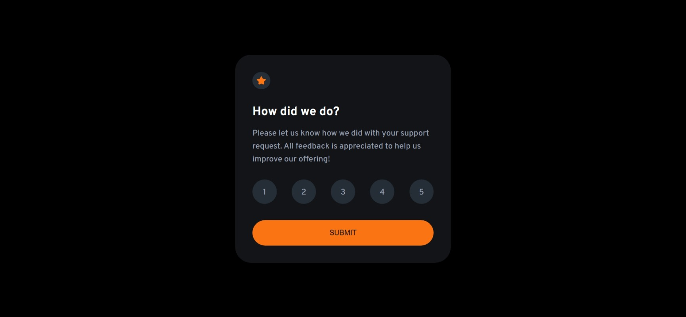

# Frontend Mentor - Interactive rating component solution

This is a solution to the [Interactive rating component challenge on Frontend Mentor](https://www.frontendmentor.io/challenges/interactive-rating-component-koxpeBUmI). Frontend Mentor challenges help you improve your coding skills by building realistic projects. 

## Table of contents

- [Overview](#overview)
  - [The challenge](#the-challenge)
  - [Screenshot](#screenshot)
  - [Links](#links)
- [My process](#my-process)
  - [Built with](#built-with)
  - [What I learned](#what-i-learned)
  - [Continued development](#continued-development)
  - [Useful resources](#useful-resources)
  - [AI Collaboration](#ai-collaboration)
- [Author](#author)
- [Acknowledgments](#acknowledgments)


## Overview

### The challenge

Users should be able to:

- View the optimal layout for the app depending on their device's screen size
- See hover states for all interactive elements on the page
- Select and submit a number rating
- See the "Thank you" card state after submitting a rating

### Screenshot

#### Desktop



#### Mobile


### Links

- Solution URL: [Add solution URL here](https://your-solution-url.com)
- Live Site URL: [Add live site URL here](https://your-live-site-url.com)

## My process

### Built with

- Built with
- Semantic HTML5
- CSS custom properties
- CSS Flexbox
- CSS media queries
- Responsive design
- Vanilla JavaScript
- DOM manipulation
- Event listeners
- querySelector() and querySelectorAll()
- forEach()
- classList


### What I learned

This project helped me strengthen my JavaScript fundamentals, particularly working with multiple DOM elements and handling user interactions.

One of the main things I learned was how querySelectorAll() returns a collection of elements and how forEach() can be used to work with each element individually.

I also learned about using an early return when no rating has been selected:

```js
if (selectedRating === "") {
    return;
}
```
This allows the button to do nothing until the user selects a rating.

### Continued development

For future projects, I want to continue improving my JavaScript logic and become more comfortable working with the DOM.

### Useful resources

- MDN Web Docs - Used as a reference for HTML, CSS and JavaScript concepts.


## Author

- Frontend Mentor - [@Chantal-Yvonne](https://www.frontendmentor.io/profile/Chantal-Yvonne)


## Acknowledgments

Thanks to Frontend Mentor for providing the challenge and design.