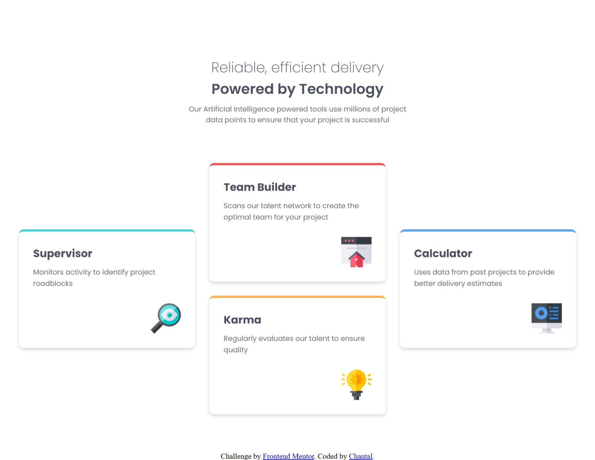
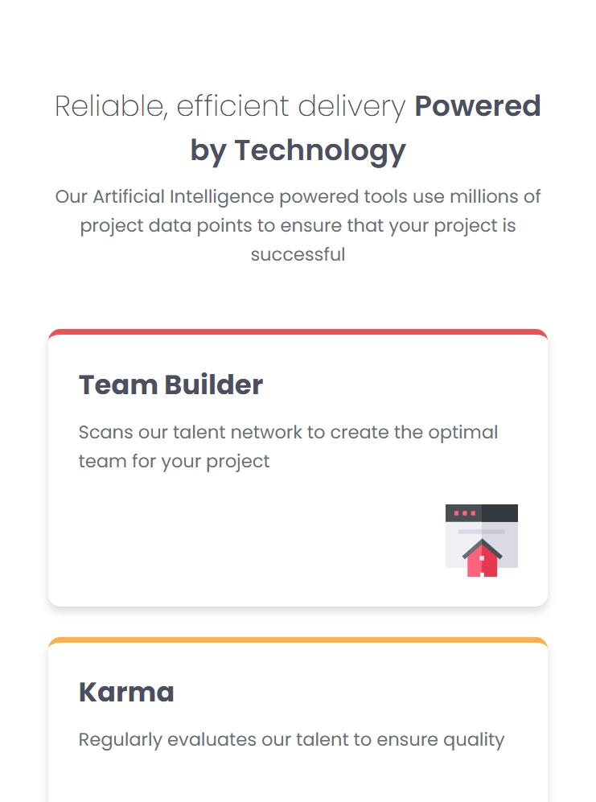

# Frontend Mentor - Four card feature section solution

This is a solution to the [Four card feature section challenge on Frontend Mentor](https://www.frontendmentor.io/challenges/four-card-feature-section-weK1eFYK). Frontend Mentor challenges help you improve your coding skills by building realistic projects. 

## Table of contents

- [Overview](#overview)
  - [The challenge](#the-challenge)
  - [Screenshot](#screenshot)
  - [Links](#links)
- [My process](#my-process)
  - [Built with](#built-with)
  - [What I learned](#what-i-learned)
  - [Continued development](#continued-development)
  - [Useful resources](#useful-resources)
- [Author](#author)
- [Acknowledgments](#acknowledgments)

## Overview

### The challenge

Users should be able to:

- View the optimal layout for the site depending on their device's screen size

### Screenshot

#### Desktop

#### Mobile

### Links

- Solution URL: [https://github.com/Chantal-Yvonne/front-end-mentor-projects/tree/main/four-card-feature-section](https://github.com/Chantal-Yvonne/front-end-mentor-projects/tree/main/four-card-feature-section)
- Live Site URL: [https://chantal-yvonne.github.io/front-end-mentor-projects/four-card-feature-section/](https://chantal-yvonne.github.io/front-end-mentor-projects/four-card-feature-section/)

## My process

### Built with

- Built with
- Semantic HTML5
- CSS custom properties
- CSS Flexbox
- CSS Grid
- CSS media queries
- Responsive design

### What I learned

This project helped me strengthen my CSS flexbox and grid skills

I learned how to better use CSS Grid to create a structured card layout, position elements within the grid, and make the layout responsive by changing the number of columns for different screen sizes.

### Continued development

For future projects, I want to continue improving my CSS Flexbox and Grid skills and become more comfortable working with the media queries.

### Useful resources

- MDN Web Docs - Used as a reference for HTML, CSS and JavaScript concepts.

## Author

- Frontend Mentor - [@Chantal-Yvonne](https://www.frontendmentor.io/profile/Chantal-Yvonne)

## Acknowledgments

Thanks to Frontend Mentor for providing the challenge and design.